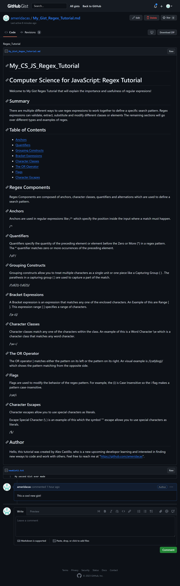

# My_CS_JS_Regex_Tutorial

# Computer Science for JavaScript: Regex Tutorial

A gist application was created to render a markdown file using .md from gist 
explaining the different methods and expresions for regex. The 
newly created gist is a tutorial that will provide a simple understanding of different examples of regular expressions.

#MockUp

#Usage

Gists can be used as a learning too or a thing to explore on github to show other fellow developers new and different ways to code.

#Credits

Github-Gist="https://gist.github.com/ameridacas/ff3d9aebdc5f91b293b0843966e47093"

Github-Deploy="https://ameridacas.github.io/My_CS_JS_Regex_Tutorial/"

Github-Repo="https://github.com/ameridacas/My_CS_JS_Regex_Tutorial/"